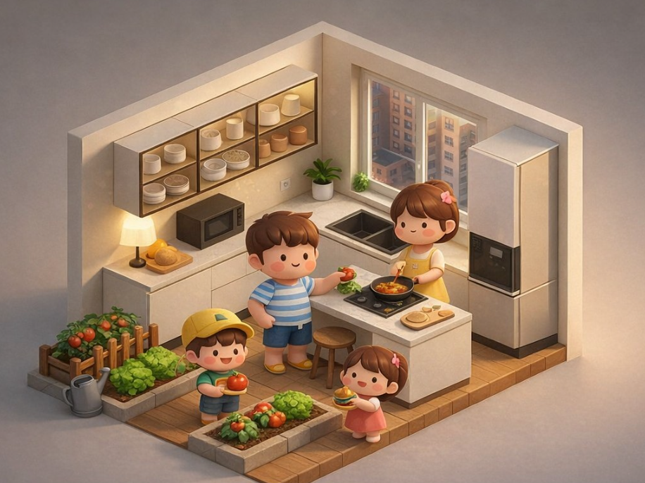

# Burger Project

※ 한글은 README_KO.md파일 참고

### "With help, 3 minutes. Without help, 10 minutes.  One action a day can become 100 memories together."



Unity WebGL cooperative cooking game prototype.

This project is a cooperative cooking game designed to solve a real social problem:
lack of daily communication between elderly parents living alone and their adult children.

The goal is not only to make a game, but to create a natural reason for daily interaction.

## Problem

Many elderly parents live alone.

- They hesitate to call their children first
- Children feel guilty but are busy
- Daily communication becomes rare
- Phone calls feel forced or awkward

Especially for elderly people living alone, even making a call can feel difficult.

We want to create a system where communication happens naturally.

## Purpose

This game creates a daily shared activity between parent and child.

Child goal

- Make burgers
- Reach 100 burgers
- Get reward (coupon)
- Faster if parent helps

Parent goal

- Help child once per day
- Check if child is active
- Feel involved
- Participate without pressure

Shared goal

- Have a reason to talk
- Have a reason to send message
- Have a reason to call
- Keep daily connection

The game becomes an excuse for communication.

## Target Users

Primary target:

- Elderly living alone
- Parents who hesitate to call first
- Adult children who feel responsible but busy

Secondary target:

- Families living apart
- Parent-child long distance

This is not only a game.

This is a communication tool.

## Phase1 Scope

- Unity UI structure
- Timer logic
- Message system
- Burger counter
- Local prototype
- Git LFS setup

---

## Gameplay Quality — Four Standards for a Perfect Burger

The quality of each burger is measured across four dimensions.
These are not just game mechanics — they reflect the care and attention that goes into a real meal.

### Freshness

Ingredients lose freshness over time, even when stored in the refrigerator.
Using each ingredient at the right moment is part of the craft.

Freshness varies by ingredient — some spoil faster than others.

| Ingredient | Fresh (100%) | Good (90%) | Fair (80%) | Discard |
|---|---|---|---|---|
| Tomato, Lettuce | Within 1 day | Day 2 | Day 3 | Over 3 days |
| Bun | Within 2 days | Day 3~4 | — | Over 4 days |
| Patty, Bacon | Within 3 days | Day 4~7 | — | Over 7 days |
| Mustard Sauce, Chili Sauce | Within 2 weeks | — | — | Over 2 weeks |

> All ingredients are stored in the refrigerator for gameplay convenience.

### Grill Accuracy

The patty has a 15-stage doneness gauge.
The guest requests a specific doneness level — hitting it precisely earns a higher score.

```
Rare │ Med-Rare │ Medium │ Med-Well │ Well-Done
 1-3 │   4-6    │  7-9   │  10-12   │  13-15

  Center slot → Perfect (×1.5)
  Side slots  → Good    (×1.0)
  Out of range → Failed  (×0.0)
```

### Supply & Ingredient Management

Ingredients must be restocked before they run out.
Running out mid-cook breaks the flow and wastes time.
Each ingredient has its own order schedule — plan ahead with expiry in mind.

| Ingredient | Order Schedule | Quantity |
|---|---|---|
| Bun | Mon / Tue / Wed / Thu / Fri (daily) | 1~2 per order |
| Patty, Bacon | Mon / Wed / Fri | 5 per order (fixed) |
| Mustard Sauce, Chili Sauce | Mon / Fri | 1 per order (fixed) |
| Tomato, Lettuce | Harvested in-game | — |

> Key principle: order with expiry in mind — not when you run out, but before you do.

### Time

Faster completion earns a time bonus — but accuracy always comes first.
A rushed burger with a failed grill scores lower than a careful, well-timed one.

| Completion Time | Bonus |
|---|---|
| Under 3 min | +20% |
| Under 5 min | +10% |
| Over 10 min | none |

### Burger Grade & Final Score

Each burger receives a grade based on its overall completion score.
A discarded burger does not count toward the burger total.

| Grade | Score Range | Burger Count |
|---|---|---|
| 🏆 Premium | 90 ~ 100 | ✅ Counted |
| ✅ Good | 70 ~ 89 | ✅ Counted |
| 🟡 Fair | 50 ~ 69 | ✅ Counted |
| ❌ Discard | Below 50 | ✗ Not counted |

```
Daily Score = (Freshness × 0.35) + (Grill Accuracy × 0.45) + (Time Bonus × 0.20)
```

Every day, one guest. One chance. One burger.
