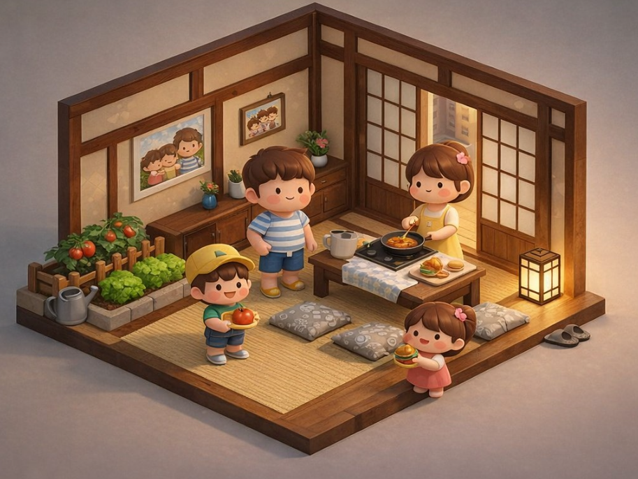

# Burger Project

### "부모가 도와주면 3분, 혼자 하면 10분.  하루 한 번의 작은 행동이, 100개의 추억이 됩니다."

Unity WebGL 기반 협동 요리 게임 프로토타입

이 프로젝트는 단순한 게임이 아니라
독거 부모와 자녀 사이의 일상적인 소통 부족 문제를 해결하기 위한 프로젝트이다.

게임을 통해 자연스럽게 연락할 이유를 만들고,
부담 없이 메시지와 통화를 할 수 있도록 유도하는 것이 목적이다.

## 문제 인식

혼자 사는 부모님들은 먼저 전화를 걸기 어려워한다.

자녀들은 바쁘고, 미안하지만 자주 연락하지 못한다.

연락은 점점 줄어들고,
통화는 어색해지고,
서로 마음은 있지만 계기가 없다.

특히 독거노인의 경우

- 먼저 연락하기 어려움
- 통화가 부담됨
- 외로움 증가
- 자녀도 걱정하지만 바쁨

그래서 자연스럽게 연결될 수 있는 장치가 필요하다.

## 목적

이 게임은 부모와 자녀가 매일 함께 하는 작은 행동을 만든다.

자녀의 목적

- 햄버거 만들기
- 100개 달성
- 10,000원 쿠폰 보상
- 부모가 도와주면 빨리 완료

부모의 목적

- 하루 1번 참여
- 자녀가 잘 하는지 확인
- 같이 한다는 느낌
- 부담 없는 참여

공통 목적

- 연락할 이유 만들기
- 메시지 보낼 이유 만들기
- 통화할 핑계 만들기
- 매일 연결 유지

이 게임은 연락 수단이 아니라

연락할 이유를 만드는 도구이다.

## 타겟 사용자

주 타겟

- 독거 부모
- 부모와 떨어져 사는 자녀
- 자주 연락 못하는 가족

부 타겟

- 장거리 가족
- 노부모 돌봄 가족

이 프로젝트는 게임이 아니라

관계를 유지하기 위한 시스템이다.

## Phase1 범위

- Unity UI 구현
- 타이머 로직
- 메시지 시스템
- 햄버거 카운트
- 로컬 MVP
- Git LFS 적용