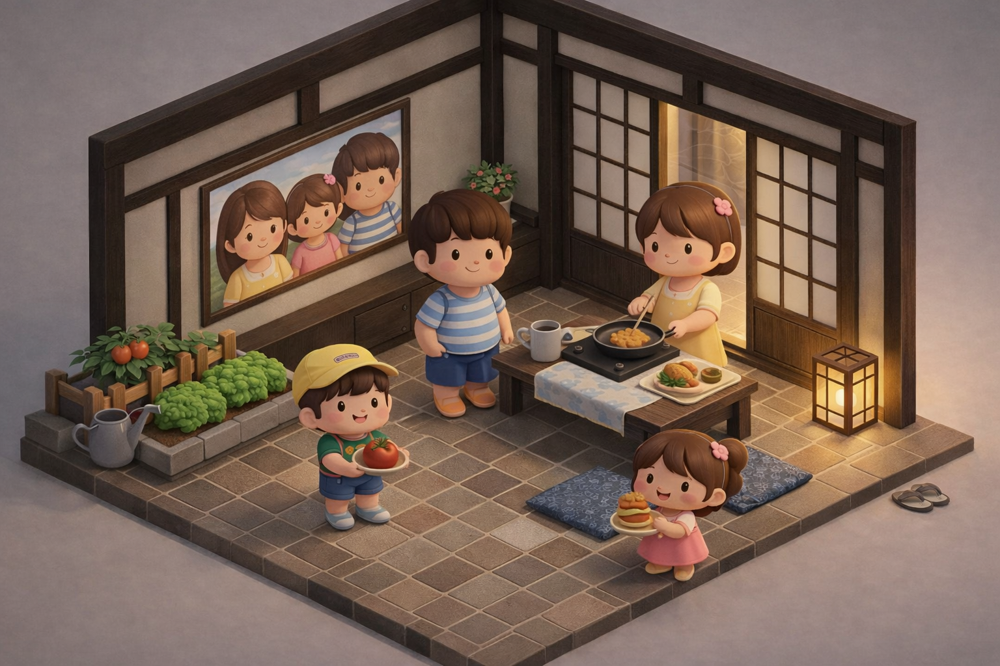

# Burger Project

### "부모가 도와주면 3분, 혼자 하면 10분.  하루 한 번의 작은 행동이, 100개의 추억이 됩니다."



Unity WebGL 기반 협동 요리 게임 프로토타입

이 프로젝트는 단순한 게임이 아니라
독거 부모와 자녀 사이의 일상적인 소통 부족 문제를 해결하기 위한 프로젝트이다.

게임을 통해 자연스럽게 연락할 이유를 만들고,
부담 없이 메시지와 통화를 할 수 있도록 유도하는 것이 목적이다.

## 문제 인식

혼자 사는 부모님들은 먼저 전화를 걸기 어려워한다.

자녀들은 바쁘고, 미안하지만 자주 연락하지 못한다.

연락은 점점 줄어들고,
통화는 어색해지고,
서로 마음은 있지만 계기가 없다.

특히 독거노인의 경우

- 먼저 연락하기 어려움
- 통화가 부담됨
- 외로움 증가
- 자녀도 걱정하지만 바쁨

그래서 자연스럽게 연결될 수 있는 장치가 필요하다.

## 목적

이 게임은 부모와 자녀가 매일 함께 하는 작은 행동을 만든다.

자녀의 목적

- 햄버거 만들기
- 100개 달성
- 10,000원 쿠폰 보상
- 부모가 도와주면 빨리 완료

부모의 목적

- 하루 1번 참여
- 자녀가 잘 하는지 확인
- 같이 한다는 느낌
- 부담 없는 참여

공통 목적

- 연락할 이유 만들기
- 메시지 보낼 이유 만들기
- 통화할 핑계 만들기
- 매일 연결 유지

이 게임은 연락 수단이 아니라

연락할 이유를 만드는 도구이다.

## 타겟 사용자

주 타겟

- 독거 부모
- 부모와 떨어져 사는 자녀
- 자주 연락 못하는 가족

부 타겟

- 장거리 가족
- 노부모 돌봄 가족

이 프로젝트는 게임이 아니라

관계를 유지하기 위한 시스템이다.

## Phase1 범위

- Unity UI 구현
- 타이머 로직
- 메시지 시스템
- 햄버거 카운트
- 로컬 MVP
- Git LFS 적용

---

## 게임플레이 품질 — 좋은 버거를 만드는 4가지 기준

버거의 완성도는 네 가지 기준으로 측정된다.
이것은 단순한 게임 메커닉이 아니라, 한 끼 식사에 담긴 정성과 집중을 반영한다.

### 신선도

수확한 재료는 냉장고에 보관해도 시간이 지날수록 신선도가 떨어진다.
적절한 타이밍에 재료를 사용하는 것도 실력이다.

재료마다 신선도가 유지되는 기간이 다르다 — 빨리 상하는 재료일수록 더 신경 써야 한다.

| 재료 | 신선 (100%) | 양호 (90%) | 보통 (80%) | 폐기 |
|---|---|---|---|---|
| 토마토, 양상추 | 1일 이내 | 2일차 | 3일차 | 3일 초과 |
| 빵(번) | 2일 이내 | 3~4일차 | — | 4일 초과 |
| 패티, 베이컨 | 3일 이내 | 4~7일차 | — | 7일 초과 |
| 머스타드 소스, 칠리 소스 | 2주 이내 | — | — | 2주 초과 |

> 모든 재료는 게임 편의상 냉장고에 보관된다.

### 굽기 정확도

패티에는 15단계 굽기 게이지가 있다.
손님이 요청한 굽기 단계에 정확히 맞출수록 높은 점수를 받는다.

```
레어 │ 미디엄레어 │ 미디엄 │ 미디엄웰던 │ 웰던
 1-3 │    4-6    │  7-9  │   10-12   │ 13-15

  중간 칸 → Perfect (×1.5)
  양쪽 칸 → Good    (×1.0)
  범위 외  → Failed  (×0.0)
```

### 발주 및 재료 관리

재료가 떨어지기 전에 발주대에서 미리 보충해야 한다.
조리 중 재료가 없으면 흐름이 끊기고 시간이 낭비된다.
재료마다 발주 주기가 다르다 — 유통기한을 고려해서 계획적으로 발주해야 한다.

| 재료 | 발주 요일 | 발주 수량 |
|---|---|---|
| 빵(번) | 월 / 화 / 수 / 목 / 금 (매일) | 1~2개 |
| 패티, 베이컨 | 월 / 수 / 금 | 5개 고정 |
| 머스타드 소스, 칠리 소스 | 월 / 금 | 1개 고정 |
| 토마토, 양상추 | 게임 내 직접 수확 | — |

> 핵심: 재고가 없을 때가 아니라, 없어지기 전에 발주한다.

### 시간

완성이 빠를수록 시간 보너스를 받는다. 단, 정확도가 항상 우선이다.
굽기를 실패한 빠른 버거는, 신중하게 만든 버거보다 점수가 낮다.

| 완성 시간 | 보너스 |
|---|---|
| 3분 이내 | +20% |
| 5분 이내 | +10% |
| 10분 초과 | 없음 |

### 버거 등급 및 최종 점수

버거는 완성도 점수에 따라 4단계 등급으로 나뉜다.
폐기 등급의 버거는 버거 카운트에 포함되지 않는다.

| 등급 | 점수 범위 | 버거 카운트 |
|---|---|---|
| 🏆 최상 | 90 ~ 100점 | ✅ 포함 |
| ✅ 상 | 70 ~ 89점 | ✅ 포함 |
| 🟡 중 | 50 ~ 69점 | ✅ 포함 |
| ❌ 폐기 | 50점 미만 | ✗ 제외 |

```
일일 점수 = (신선도 × 0.35) + (굽기 정확도 × 0.45) + (시간 보너스 × 0.20)
```

매일, 손님은 한 명. 기회는 한 번. 버거는 하나.
