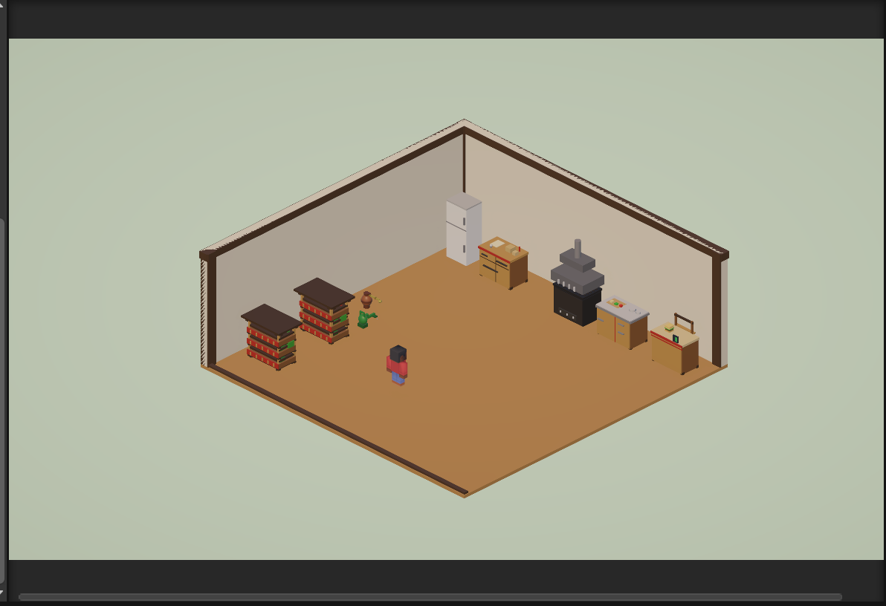

# Changelog

## [0.5.1] - 2026-06-10

### 수정
- 농장 시간 표지의 큰 파란 배경을 제거
- 오래된 농장 시간 표지는 감지 시 재생성되도록 정리
- 농장 상호작용 말풍선의 시간 배지를 축소해 본문 가림을 완화

### 변경
- 디버그 로그와 HUD 텍스트를 짧게 정리
- 손에 든 아이템이 더 명확하게 보이도록 조정
- 빠른 실행 버튼 패널은 다른 브랜치 작업으로 분리

## [0.5.0] - 2026-03-29

### 추가
- **주방 스테이션 5종 — 전체 조리 파이프라인 완성**
  - `Refrigerator` (냉장고) — 시각 소품. 스테인리스 냉장고를 왼쪽 벽에 배치해 재료 공급 맥락을 시각적으로 설명
  - `SupplyStation` (발주대) — 한옥 전통 목재 주문 카운터. [E]로 빵·생패티·생베이컨·소스 각 +3 보충, 20초 쿨다운
  - `GrillStation` (불판) — 주철 그릴 + 3층 화염 비주얼(빨강→주황→노랑) + 환기 후드. [E]로 굽기 시작, 15초 후 완료, 8초 내 수거 안 하면 탄 처리
  - `CookStation` (조리대) — 스테인리스 상판 + 한옥 하부 구조. 5단계 버거 조립 (Idle → Preparing → Assembling → AddSauce → Done)
  - `ServeCounter` (서빙 카운터) — 한옥 목재 카운터 + 서빙 창구 + 미니 버거 모형. [E]로 완성 버거 제출 → `GameManager.ServeBurger()` → 버거 카운트 +1

- **에디터 자동화**
  - `KitchenStationsBuilder` — `Tools/100 Burger Family/Build Kitchen Stations` 메뉴 한 번으로 5개 스테이션 일괄 배치. 팜 오브젝트 건드리지 않음, 재실행 안전

- **전체 게임 루프 완성**
  - 팜 → 발주대 → 불판 → 조리대 → 서빙까지 엔드투엔드 플레이 가능

### 변경
- `SampleScene.unity`
  - RoomScene에 냉장고·발주대·불판·조리대·서빙 카운터 추가
  - 이전 세션에서 수동 조정한 TomatoFarm·LettuceFarm·WateringJar·character-b 위치 유지

### 참고
- 스테이션 라벨 폰트 워닝(`MalgunGothic SDF`)은 시각적 문제이며 게임플레이에 영향 없음
- 냉장고에 스크립트가 없는 것은 의도적 설계 — 재료 보충은 발주대(SupplyStation)가 전담

---

## [0.4.0] - 2026-03-25

### Added
- **스마트 실내 재배기 시스템 확장**
  - `FarmStation` — 작물 수확 로직 개선 및 상태 확장
  - `IngredientType` — 재료 타입 정의 (토마토, 양상추 등)
  - `InventoryManager` — 플레이어 인벤토리 관리 시스템 추가
  - `FarmInteractionBubble` — 작물 성장 단계별 시각 가이드 (씨앗 / 물주기 / 수확)

- **농장 워크플로우 개선**
  - 재배 → 수확 → 조리 → 서빙 흐름 기반 구조 확장
  - 작물별 상호작용 분기 기반 시스템 도입

- **에디터 자동 배치 시스템**
  - `FarmStationBuilder` — 농장 오브젝트 자동 생성 및 배치 툴
  - 3층 구조 재배기 자동 생성 (카트형 구조)
  - 씬 내 위치 자동 정렬 및 반복 생성 지원

- **비주얼 및 씬 개선**
  - FarmStation 모델 구조 개선 (3단 구조 재배기)
  - 씬 내 오브젝트 재배치 및 레이아웃 조정
  - 한옥 테마 스타일 적용 (목재 구조, 창살, 조명 등)
  - 상호작용 오브젝트 시각적 명확성 개선

### Changed
- `SampleScene.unity`
  - 전체 레이아웃 재구성 (FarmStation, 동선, 오브젝트 배치)
  - 농장 위치 좌측 벽 기준으로 재정렬

- `GameManager`
  - 게임 흐름 제어 로직 일부 개선

- `CookStation`
  - 조리 로직 확장 준비 구조로 리팩토링

- `InGameHUD`
  - UI 업데이트 흐름 개선

- `PlayerHand`
  - 재료 처리 흐름 확장 대응

- `ServeCounter`
  - 서빙 처리 구조 개선

### Fixed
- 아이소메트릭 좌표 기준으로 오브젝트가 화면 상단에 몰리는 문제 수정
- FarmStation 위치 계산 로직 보정 (x + z 기준 보정)

---

## [0.3.0] - 2026-03-22

### Added
- **아이소메트릭 게임 씬 구현** (Overcooked / 고양이와 비밀레시피 스타일)
  - `IsometricCameraController` — 런타임 직교 카메라(Euler 30°/-45°, SE → NW) 강제 적용
  - `PlayerController` — WASD 이동 (New Input System), 아이소메트릭 방향 보정
  - `PlayerHand` — 재료 들기/내려놓기 상태 관리
  - `FarmStation` — 농장 수확 스테이션, 쿨다운 포함, UI "🌿 실내 스마트 재배기"
  - `CookStation` — 조리 스테이션 (그릴)
  - `ServeCounter` — 버거 서빙 카운터, 버거 카운트 증가
  - `Interactable` / `InteractionBubble` — E키 상호작용 시스템, 근접 말풍선 (World Space Canvas)
  - `InGameHUD` — 버거 카운트 HUD 연동
  - `RoomManager` — 멀티플레이어 방 참여/나가기 로직

- **에디터 툴**
  - `SceneCleanup` → `Tools/Full Reset Isometric`
  - `KoreanFontSetup` → `Tools/Setup Korean Font`
  - `IsometricSetup`, `RoomSceneSetup`

- **한국어 폰트**
  - `Assets/Fonts/MalgunGothic SDF.asset`
  - TMP Settings 기본 폰트 교체

### Changed
- `UIScreenController`
- `GameManager`
- `RoomState`

---

## [0.2.0] - 2026-03-XX

### Added
- UI 패널 흐름 완성: MainMenu → Lobby → InGame → Result
- 이미지 에셋 삽입

---

## [0.1.0] - 2026-03-XX

### Added
- Unity 프로젝트 초기 세팅 (WebGL 빌드 타겟)
# 2026-06-11

- `Assets/ExternalAssets/AssetPackUI/pack_001.png`를 기준으로 UI 적용 스크립트 경로를 추가했습니다.
- 농장 상호작용/시간 말풍선을 줄여서 타이머 배지가 안내 문구를 덜 가리게 정리했습니다.
- `SampleScene`의 `UIScreenController` HUD 참조를 활성 패널에 연결했습니다.
